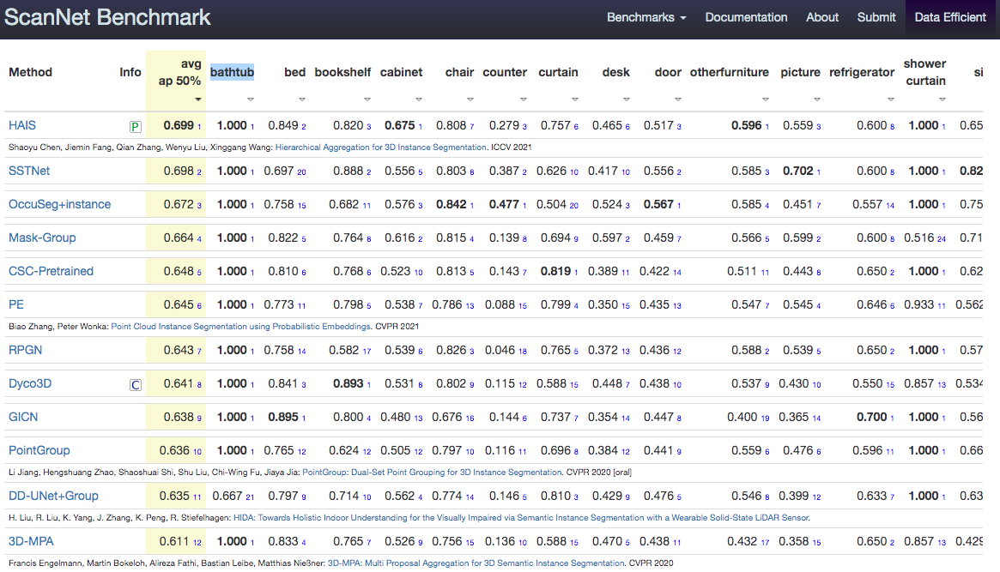

# HAIS   

[](https://paperswithcode.com/sota/3d-instance-segmentation-on-scannetv2?p=hierarchical-aggregation-for-3d-instance) [](https://paperswithcode.com/sota/3d-instance-segmentation-on-s3dis?p=hierarchical-aggregation-for-3d-instance)

### Hierarchical Aggregation for 3D Instance Segmentation (ICCV 2021)


by Shaoyu Chen, Jiemin Fang, Qian Zhang, Wenyu Liu, Xinggang Wang*. (\*) Corresponding author.
[arXiv technical report (arXiv 2108.02350)](https://arxiv.org/abs/2108.02350)

<div align="center">


</div>

<br>

### Introduction
* HAIS is an efficient and concise bottom-up framework for point cloud instance segmentation. It adopts the  hierarchical aggregation (point aggregation and set aggregation) to generate instances and the intra-instance prediction for outlier filtering and mask quality scoring.
* HAIS [ranks 1st](http://kaldir.vc.in.tum.de/scannet_benchmark/semantic_instance_3d) on the [ScanNet benchmark](http://kaldir.vc.in.tum.de/scannet_benchmark/semantic_instance_3d) (Aug. 8th, 2021).
* Thanks to the NMS-free and single-forward inference design, HAIS achieves the best inference speed among all existing methods (**410ms** per frame on average for large-scale point cloud containing hundreds of thousands of points).

##### Code will be released soon.





### Citation
```
@article{chen2021hierarchical,
      title={Hierarchical Aggregation for 3D Instance Segmentation}, 
      author={Shaoyu Chen and Jiemin Fang and Qian Zhang and Wenyu Liu and Xinggang Wang},
      year={2021},
      journal={arXiv:2108.02350},
}
```